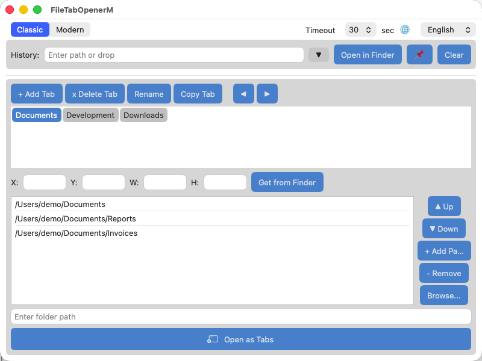
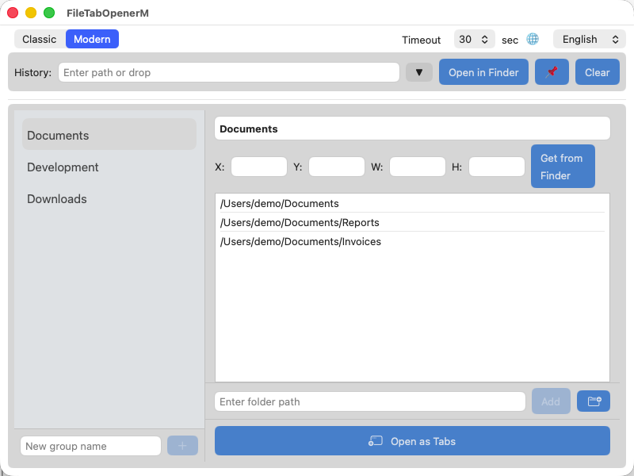

[English](README.md) | [日本語](README_ja.md) | [한국어](README_ko.md) | [繁體中文](README_zh_TW.md) | [简体中文](README_zh_CN.md)

# File Tab Opener (macOS Native)

A native SwiftUI application for managing and opening folders as Finder tabs on macOS.

This is the macOS-native version of [file_tab_opener](https://github.com/obott9/file_tab_opener) (Python/Tk), rebuilt with SwiftUI for a modern macOS-native UI experience.

## Features

- **Tab Group Management** - Create, rename, copy, delete, and reorder tab groups
- **One-Click Open** - Open all folders in a tab group as Finder tabs in a single window
- **Modern Layout** - Sidebar + detail panel with dropdown-based reordering, context menus, and inline editing — alongside a Classic layout compatible with the Python version
- **Native macOS Experience** - Dark mode, drag & drop, system font rendering — all following macOS conventions automatically
- **Folder History** - Recently opened folders with pin support
- **Window Geometry** - Save and restore Finder window position/size per tab group
- **Reliable Tab Control** - AX API + AppleScript hybrid approach; AX API creates tabs without keyboard simulation, avoiding System Events permission issues
- **Internationalization** - English, Japanese, Korean, Traditional/Simplified Chinese
- **Path Validation** - Checks path existence and prevents duplicates on add
- **Drag & Drop** - Drop folders onto the path entry field to add paths

## Screenshots

| Classic Layout | Modern Layout |
|:-:|:-:|
|  |  |

## Why Native Version?

The Python/Tk version uses `System Events` keystroke (⌘T) to create Finder tabs, which requires keyboard simulation permission and can conflict with user input. The native version replaces this with **Accessibility API** (AX API), pressing Finder's "New Tab" button programmatically — no keyboard events involved.

Tab opening speed is comparable to the Python version (~3 seconds for 10 tabs). The main advantage of the native version is the **SwiftUI-based Modern layout**: sidebar navigation, dropdown reordering, context menus, native drag & drop, and automatic dark mode — features that are difficult to achieve with Tk/customtkinter.

## Download

Download the latest `.app` from [GitHub Releases](https://github.com/obott9/FileTabOpenerM/releases).

> **Note:** This app is not notarized. On first launch, macOS Gatekeeper may block it. Right-click the app and select "Open", then click "Open" in the dialog to bypass the warning.

## Requirements

- macOS 12 Monterey or later
- Accessibility permission (prompted on first launch)

## Build

1. Open `FileTabOpenerM.xcodeproj` in Xcode
2. Select the `FileTabOpenerM` scheme
3. Build and run (Cmd+R)

## Usage

1. Launch the application
2. Grant Accessibility permission when prompted (required for Finder tab control)
3. Create a tab group with **+ Add Tab**
4. Add folder paths using the path entry field, **Browse...**, or drag & drop
5. Click **Open as Tabs** to open all folders as Finder tabs in one window

### How It Works

The application uses a hybrid approach to control Finder tabs:

1. **AX API** (Accessibility API) - Creates new tabs by programmatically pressing Finder's "New Tab" button, eliminating keyboard simulation entirely.
2. **AppleScript** - Sets the target path of each new tab via `set target of front Finder window`. Uses pre-compiled NSAppleScript with handler calls to avoid repeated compilation.
3. **Fallback** - If tab creation fails, opens remaining paths as separate Finder windows.

Tab readiness is detected by monitoring AXUIElement child count changes rather than fixed-delay polling, enabling reliable operation across different Mac hardware.

## Configuration

Configuration is stored in JSON format at:

```
~/Library/Application Support/FileTabOpenerM/config.json
```

The config file is compatible with the Python version (file_tab_opener).

## Logging

Logs are written to:

```
~/Library/Logs/FileTabOpenerM/app.log
```

Log files are rotated when exceeding 1 MB, with up to 3 backup generations (`app.log.1`, `app.log.2`, `app.log.3`).

## Project Structure

```
FileTabOpenerM/
  FileTabOpenerMApp.swift             # App entry point, window geometry save/restore
  ContentView.swift                   # Main UI, shared views, state properties
  ContentView+ClassicLayout.swift     # Classic layout (Python version compatible)
  ContentView+ModernLayout.swift      # Modern layout (sidebar + detail panel)
  ContentView+Actions.swift           # All action methods (tab/path/history management)
  Theme.swift                         # Color theme, button styles
  FlowLayout.swift                    # Flow layout for tab button wrapping
  FinderTabController.swift           # AX API + AppleScript Finder tab control
  ConfigManager.swift                 # JSON configuration management
  TabGroup.swift                      # Data model (Codable, Python-compatible)
  Localization.swift                  # i18n (5 languages, 53 keys)
  AppLogger.swift                     # File logger with 3-generation rotation
  Assets.xcassets/                    # App icon and color assets
FileTabOpenerMTests/
  FileTabOpenerMTests.swift           # 25 unit tests (Codable, i18n, helpers)
```

## Author

[obott9](https://github.com/obott9)

## License

[MIT License](LICENSE)
