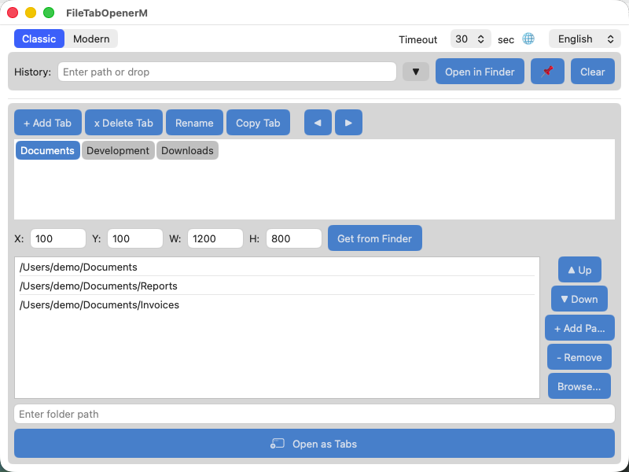
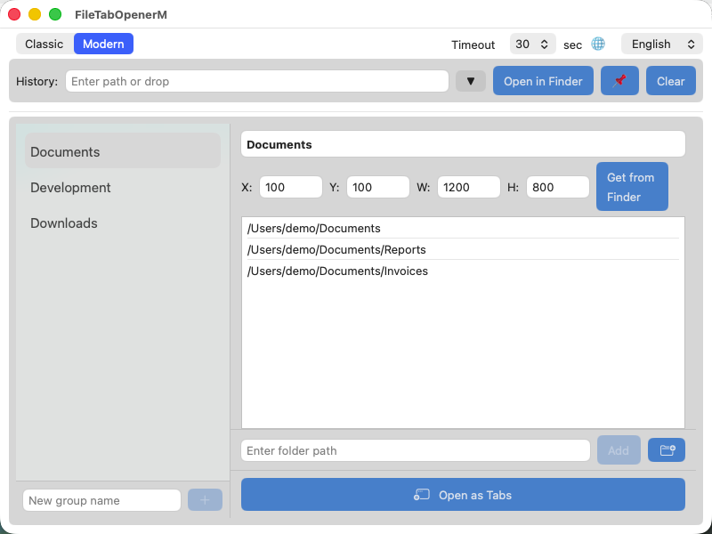

[English](README.md) | [日本語](README_ja.md) | [한국어](README_ko.md) | [繁體中文](README_zh_TW.md) | [简体中文](README_zh_CN.md)

# File Tab Opener (macOS ネイティブ)

フォルダを Finder のタブとしてまとめて開くための macOS ネイティブ SwiftUI アプリケーションです。

[file_tab_opener](https://github.com/obott9/file_tab_opener)（Python/Tk版）の macOS ネイティブ版で、SwiftUI によるモダンな macOS ネイティブ UI を提供します。

## 機能

- **タブグループ管理** - タブグループの作成、名前変更、複製、削除、並べ替え
- **ワンクリックで開く** - タブグループ内の全フォルダを1つの Finder ウィンドウのタブとして開く
- **モダンレイアウト** - サイドバー＋詳細パネル、ドロップダウンによる並べ替え、コンテキストメニュー、インライン編集 — Python版互換のクラシックレイアウトも搭載
- **macOS ネイティブ体験** - ダークモード、ドラッグ＆ドロップ、システムフォント描画 — すべて macOS の作法に自動追従
- **フォルダ履歴** - 最近開いたフォルダの履歴（ピン留め対応）
- **ウィンドウジオメトリ** - タブグループごとに Finder ウィンドウの位置・サイズを保存・復元
- **安定したタブ制御** - AX API + AppleScript のハイブリッド方式。AX API によりキーボードシミュレーション不要で、System Events 権限の問題を回避
- **多言語対応** - 英語、日本語、韓国語、繁体中国語、簡体中国語
- **パス検証** - 追加時にパスの存在確認と重複チェック
- **ドラッグ＆ドロップ** - パス入力フィールドにフォルダをドロップして追加

## スクリーンショット

| クラシックレイアウト | モダンレイアウト |
|:-:|:-:|
|  |  |

## なぜネイティブ版？

Python/Tk版は `System Events` のキーストローク（⌘T）で Finder タブを作成しますが、これにはキーボードシミュレーション権限が必要で、ユーザー入力と干渉する可能性があります。ネイティブ版は **Accessibility API**（AX API）でFinderの「新規タブ」ボタンをプログラムで押下する方式に置き換え、キーボードイベントを一切使いません。

タブ展開速度は Python 版と同等（10タブで約3秒）です。ネイティブ版の主な利点は **SwiftUI ベースのモダンレイアウト** — サイドバーナビゲーション、ドロップダウンによる並べ替え、コンテキストメニュー、ネイティブのドラッグ＆ドロップ、自動ダークモード — Tk/customtkinter では実現が難しい機能群です。

## ダウンロード

最新の `.app` は [GitHub Releases](https://github.com/obott9/FileTabOpenerM/releases) からダウンロードできます。

> **注意:** このアプリは公証（Notarization）されていません。初回起動時に macOS Gatekeeper がブロックする場合があります。アプリを右クリック →「開く」を選択し、ダイアログで「開く」をクリックしてください。

## 動作環境

- macOS 12 Monterey 以降
- アクセシビリティ権限（初回起動時に確認ダイアログが表示されます）

## ビルド

1. Xcode で `FileTabOpenerM.xcodeproj` を開く
2. `FileTabOpenerM` スキームを選択
3. ビルド＆実行（Cmd+R）

## 使い方

1. アプリケーションを起動
2. アクセシビリティ権限を許可（Finder タブ制御に必要）
3. **+ タブ追加** でタブグループを作成
4. パス入力フィールド、**参照...**、またはドラッグ＆ドロップでフォルダパスを追加
5. **タブで開く** をクリックして全フォルダを Finder タブとして開く

### 動作の仕組み

本アプリケーションは Finder タブ制御にハイブリッド方式を採用しています：

1. **AX API**（Accessibility API） - Finder の「新規タブ」ボタンをプログラムで押下して新しいタブを作成。キーボードシミュレーションを完全に排除。
2. **AppleScript** - `set target of front Finder window` で各タブのパスを設定。プリコンパイルされた NSAppleScript のハンドラ呼び出しにより、再コンパイルのオーバーヘッドを排除。
3. **フォールバック** - タブ作成に失敗した場合、残りのパスを個別の Finder ウィンドウとして開く。

タブの準備完了は固定遅延ではなく AXUIElement の子要素数の変化を監視して検出するため、Mac のハードウェア性能に関わらず安定動作します。

## 設定

設定は JSON 形式で以下に保存されます：

```
~/Library/Application Support/FileTabOpenerM/config.json
```

設定ファイルは Python 版（file_tab_opener）と互換性があります。

## ログ

ログは以下に出力されます：

```
~/Library/Logs/FileTabOpenerM/app.log
```

ログファイルは 1 MB を超えると自動ローテーションされ、最大3世代のバックアップ（`app.log.1`、`app.log.2`、`app.log.3`）が保持されます。

## プロジェクト構成

```
FileTabOpenerM/
  FileTabOpenerMApp.swift             # アプリエントリポイント、ウィンドウジオメトリ保存・復元
  ContentView.swift                   # メインUI、共有ビュー、状態プロパティ
  ContentView+ClassicLayout.swift     # クラシックレイアウト（Python版準拠）
  ContentView+ModernLayout.swift      # モダンレイアウト（サイドバー＋詳細パネル）
  ContentView+Actions.swift           # 全アクションメソッド（タブ/パス/履歴管理）
  Theme.swift                         # カラーテーマ、ボタンスタイル
  FlowLayout.swift                    # タブボタン折り返しレイアウト
  FinderTabController.swift           # AX API + AppleScript による Finder タブ制御
  ConfigManager.swift                 # JSON 設定ファイル管理
  TabGroup.swift                      # データモデル（Codable、Python版互換）
  Localization.swift                  # 多言語対応（5言語、53キー）
  AppLogger.swift                     # ファイルロガー（3世代ローテーション）
  Assets.xcassets/                    # アプリアイコン・カラーアセット
FileTabOpenerMTests/
  FileTabOpenerMTests.swift           # ユニットテスト 25件（Codable、i18n、ヘルパー）
```

## ライセンス

[MIT License](LICENSE)
