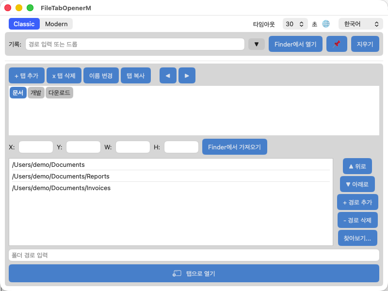
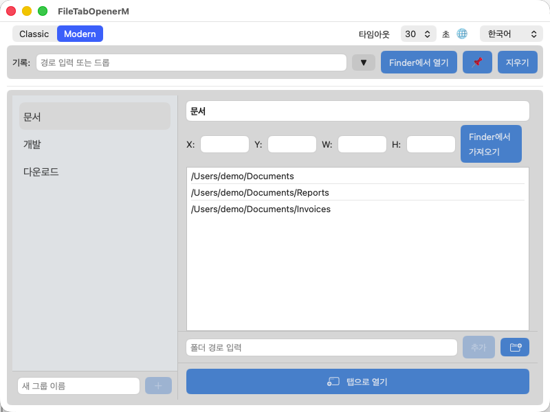

[English](README.md) | [日本語](README_ja.md) | [한국어](README_ko.md) | [繁體中文](README_zh_TW.md) | [简体中文](README_zh_CN.md)

# File Tab Opener (macOS 네이티브)

폴더를 Finder 탭으로 일괄 열기 위한 macOS 네이티브 SwiftUI 애플리케이션입니다.

[file_tab_opener](https://github.com/obott9/file_tab_opener)(Python/Tk 버전)의 macOS 네이티브 버전으로, SwiftUI로 모던한 macOS 네이티브 UI를 제공합니다.

## 기능

- **탭 그룹 관리** - 탭 그룹 생성, 이름 변경, 복사, 삭제, 순서 변경
- **원클릭 열기** - 탭 그룹의 모든 폴더를 하나의 Finder 윈도우에 탭으로 열기
- **모던 레이아웃** - 사이드바 + 상세 패널, 드롭다운 정렬, 컨텍스트 메뉴, 인라인 편집 — Python 버전 호환 클래식 레이아웃도 탑재
- **macOS 네이티브 경험** - 다크 모드, 드래그 앤 드롭, 시스템 폰트 렌더링 — 모두 macOS 규칙에 자동 대응
- **폴더 기록** - 최근 열었던 폴더 기록 (고정 지원)
- **윈도우 위치 저장** - 탭 그룹별로 Finder 윈도우 위치 및 크기 저장·복원
- **안정적 탭 제어** - AX API + AppleScript 하이브리드 방식. AX API로 키보드 시뮬레이션 없이 탭 생성, System Events 권한 문제 회피
- **다국어 지원** - 영어, 일본어, 한국어, 번체 중국어, 간체 중국어
- **경로 검증** - 추가 시 경로 존재 확인 및 중복 검사
- **드래그 앤 드롭** - 경로 입력 필드에 폴더를 드롭하여 추가

## 스크린샷

| 클래식 레이아웃 | 모던 레이아웃 |
|:-:|:-:|
|  |  |

## 왜 네이티브 버전인가?

Python/Tk 버전은 `System Events` 키스트로크(⌘T)로 Finder 탭을 생성하며, 이는 키보드 시뮬레이션 권한이 필요하고 사용자 입력과 충돌할 수 있습니다. 네이티브 버전은 **Accessibility API**(AX API)로 Finder의 "새 탭" 버튼을 프로그래밍 방식으로 눌러 키보드 이벤트를 사용하지 않습니다.

탭 열기 속도는 Python 버전과 동등합니다(10개 탭에 약 3초). 네이티브 버전의 주요 이점은 **SwiftUI 기반 모던 레이아웃** — 사이드바 내비게이션, 드롭다운 정렬, 컨텍스트 메뉴, 네이티브 드래그 앤 드롭, 자동 다크 모드 — Tk/customtkinter로는 구현이 어려운 기능들입니다.

## 다운로드

최신 `.app`은 [GitHub Releases](https://github.com/obott9/FileTabOpenerM/releases)에서 다운로드할 수 있습니다.

> **참고:** 이 앱은 공증(Notarization)되지 않았습니다. 첫 실행 시 macOS Gatekeeper가 차단할 수 있습니다. 앱을 우클릭 → "열기"를 선택하고 대화 상자에서 "열기"를 클릭하세요.

## 시스템 요구 사항

- macOS 12 Monterey 이상
- 손쉬운 사용 권한 (첫 실행 시 확인 대화 상자가 표시됩니다)

## 빌드

1. Xcode에서 `FileTabOpenerM.xcodeproj` 열기
2. `FileTabOpenerM` 스킴 선택
3. 빌드 및 실행 (Cmd+R)

## 사용 방법

1. 애플리케이션 실행
2. 손쉬운 사용 권한 허용 (Finder 탭 제어에 필요)
3. **+ 탭 추가**로 탭 그룹 생성
4. 경로 입력 필드, **찾아보기...** 또는 드래그 앤 드롭으로 폴더 경로 추가
5. **탭으로 열기**를 클릭하여 모든 폴더를 Finder 탭으로 열기

### 동작 원리

본 애플리케이션은 Finder 탭 제어에 하이브리드 방식을 채택합니다:

1. **AX API** (Accessibility API) - Finder의 "새 탭" 버튼을 프로그래밍 방식으로 눌러 새 탭 생성. 키보드 시뮬레이션을 완전히 제거.
2. **AppleScript** - `set target of front Finder window`로 각 탭의 경로 설정. 사전 컴파일된 NSAppleScript 핸들러 호출로 재컴파일 오버헤드 제거.
3. **폴백** - 탭 생성 실패 시 나머지 경로를 별도 Finder 윈도우로 열기.

탭 준비 완료 감지는 고정 딜레이가 아닌 AXUIElement 자식 요소 수 변화 모니터링을 사용하므로 Mac 하드웨어 성능에 관계없이 안정적으로 동작합니다.

## 설정

설정은 JSON 형식으로 다음 위치에 저장됩니다:

```
~/Library/Application Support/FileTabOpenerM/config.json
```

설정 파일은 Python 버전(file_tab_opener)과 호환됩니다.

## 로그

로그는 다음 위치에 기록됩니다:

```
~/Library/Logs/FileTabOpenerM/app.log
```

로그 파일은 1 MB를 초과하면 자동 로테이션되며 최대 3세대 백업(`app.log.1`, `app.log.2`, `app.log.3`)이 유지됩니다.

## 프로젝트 구조

```
FileTabOpenerM/
  FileTabOpenerMApp.swift             # 앱 진입점, 윈도우 위치 저장·복원
  ContentView.swift                   # 메인 UI, 공유 뷰, 상태 프로퍼티
  ContentView+ClassicLayout.swift     # 클래식 레이아웃 (Python 버전 호환)
  ContentView+ModernLayout.swift      # 모던 레이아웃 (사이드바 + 상세 패널)
  ContentView+Actions.swift           # 전체 액션 메서드 (탭/경로/히스토리 관리)
  Theme.swift                         # 컬러 테마, 버튼 스타일
  FlowLayout.swift                    # 탭 버튼 줄바꿈 레이아웃
  FinderTabController.swift           # AX API + AppleScript Finder 탭 제어
  ConfigManager.swift                 # JSON 설정 관리
  TabGroup.swift                      # 데이터 모델 (Codable, Python 버전 호환)
  Localization.swift                  # 다국어 지원 (5개 언어, 53개 키)
  AppLogger.swift                     # 파일 로거 (3세대 로테이션)
  Assets.xcassets/                    # 앱 아이콘·색상 에셋
FileTabOpenerMTests/
  FileTabOpenerMTests.swift           # 유닛 테스트 25건 (Codable, i18n, 헬퍼)
```

## 작성자

[obott9](https://github.com/obott9)

## 라이선스

[MIT License](LICENSE)
